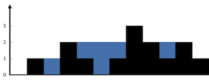

## 4. [接雨水](https://leetcode-cn.com/problems/trapping-rain-water/)

### 题目描述
给定 n 个非负整数表示每个宽度为 1 的柱子的高度图，计算按此排列的柱子，下雨之后能接多少雨水。

 


**示例:**
```
给定 n 个非负整数表示每个宽度为 1 的柱子的高度图，计算按此排列的柱子，下雨之后能接多少雨水。


示例 1：




输入：height = [0,1,0,2,1,0,1,3,2,1,2,1]
输出：6
解释：上面是由数组 [0,1,0,2,1,0,1,3,2,1,2,1] 表示的高度图，在这种情况下，可以接 6 个单位的雨水（蓝色部分表示雨水）。 
示例 2：

输入：height = [4,2,0,3,2,5]
输出：9


```

### 解题思路

```
我们只在乎min(l_max, r_max)。对于上图的情况，我们已经知道l_max < r_max了，至于这个r_max是不是右边最大的，不重要。重要的是height[i]能够装的水只和较低的l_max之差有关：

```
### 代码实现
```go

func trap(height []int) int {

    res :=0
    size := len(height)
    l_max := height[0]
    r_max := height[size-1] 
    left := 0
    right := size -1
    for left <= right{
        l_max = max(l_max,height[left])
        r_max = max(r_max,height[right]) 

        if l_max < r_max { 

            res += l_max - height[left] //已经做了两个值的max 比较。  
            left++
        }else {
            res += r_max - height[right]
            right--
        }

    }
    
    
    return res
}
```
